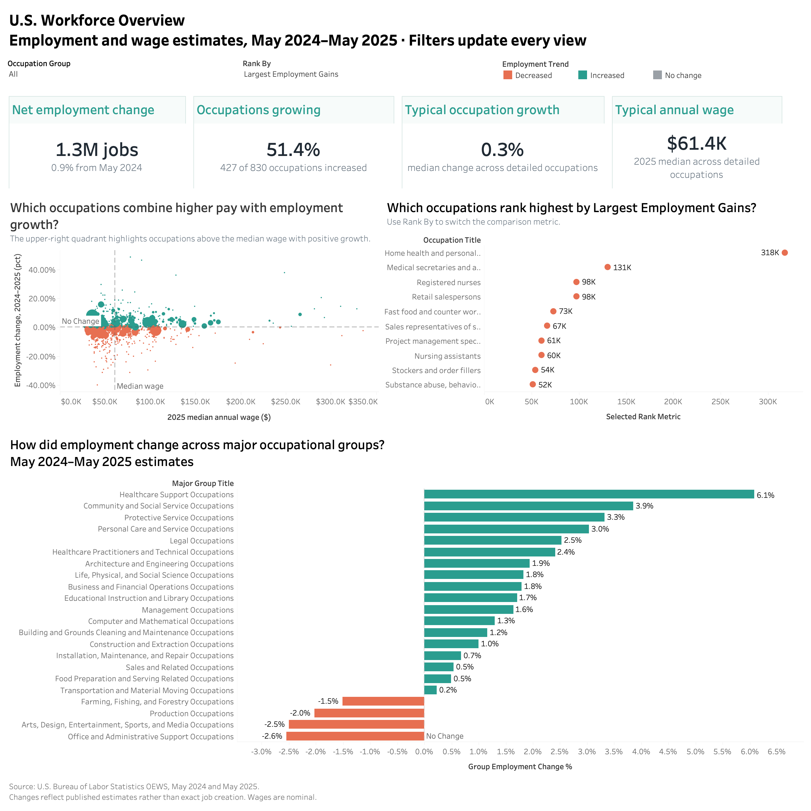
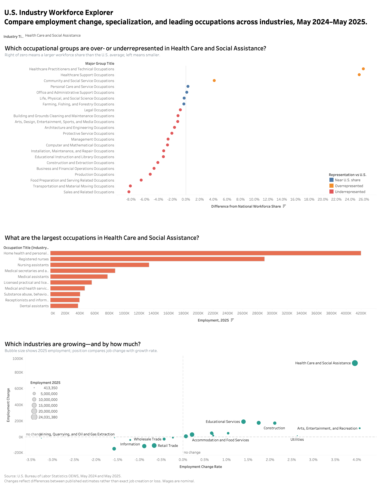
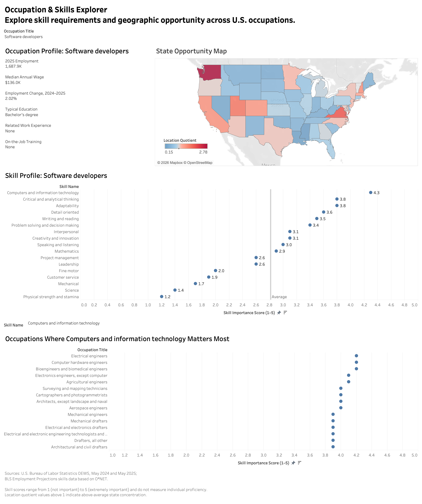

# U.S. Workforce Intelligence Explorer

An interactive Tableau dashboard for researching U.S. industries, occupations, skills, wages, and regional employment patterns.

[View the interactive dashboard on Tableau Public](https://public.tableau.com/app/profile/jiashu.huang/viz/U_S_WorkforceIntelligenceExplorer/WorkforceOverview)

## Purpose

Labor market data is often spread across large tables that are difficult to compare. This project brings selected Bureau of Labor Statistics datasets into one research tool for people evaluating industries, occupations, or career directions.

The dashboard is intended to support exploration rather than prescribe a single "best" career.

## Intended audience

- Job seekers and career changers researching unfamiliar fields
- Students comparing career and education options
- Analysts exploring workforce and industry trends

## Dashboard pages

### 1. Workforce Overview

A national view of employment and wage changes from May 2024 to May 2025, with occupation rankings and comparisons across major occupational groups.



### 2. Industry Deep Dive

An industry research view showing changes in employment estimates and occupational composition. Users can select an industry and inspect the occupations that contribute most to its workforce.



### 3. Occupation & Skills Explorer

An occupation-level view combining skill profiles with a state map. Users can compare skills, wages, employment concentration, and geographic differences for a occupation.



## Selected findings

- Published employment estimates increased by 0.9%, or about 1.3 million jobs, while only 51.4% of detailed occupations recorded growth.
- Healthcare support had the strongest increase among major occupational groups at 6.1%; office and administrative support declined by 2.6%.
- Home health and personal care aides recorded the largest employment gain, adding approximately 318,000 jobs in the published estimates.
- Software developers reached about 1.69 million jobs and a $136,000 median annual wage in 2025; computers and information technology was their highest-rated skill category.

## Methodology

- Detailed occupation records from the 2024 and 2025 OEWS releases are aligned by occupation code; industry and state tables use an outer join to retain records reported in only one year.
- Employment and nominal wage changes are calculated against the 2024 estimate. Suppressed or unavailable source values remain missing rather than being imputed.
- Education and training attributes come from the BLS Employment Projections matrix. Each occupation is also matched to 17 BLS skill categories derived from O*NET measures.
- Tableau relates the four prepared tables through `occupation_code`, preserving their different levels of detail without multiplying rows.

## Data sources

The project uses May 2024 and May 2025 OEWS estimates with the latest BLS occupational skills and education data.

The four prepared tables connect on `occupation_code`: occupations, industry occupations, occupation skills, and state occupations. Employment changes describe changes in published OEWS estimates rather than exact job creation; wages are nominal.

## Rebuild the data

Download the 2024 OEWS [national](https://www.bls.gov/oes/special-requests/oesm24nat.zip), [state](https://www.bls.gov/oes/special-requests/oesm24st.zip), and [industry](https://www.bls.gov/oes/special-requests/oesm24in4.zip) files; the matching 2025 [national](https://www.bls.gov/oes/special-requests/oesm25nat.zip), [state](https://www.bls.gov/oes/special-requests/oesm25st.zip), and [industry](https://www.bls.gov/oes/special-requests/oesm25in4.zip) files; plus [occupation data](https://www.bls.gov/emp/ind-occ-matrix/occupation.xlsx) and [skills data](https://www.bls.gov/emp/skills/public-skills-data.xlsx). Save all eight files in `data/raw/`, then run:

```bash
pip install -r requirements.txt
python src/prepare_data.py
```
